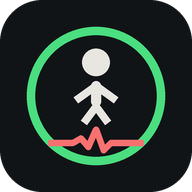

<div align="center">



# CuidAPP

**Detección automática de caídas y aviso remoto,
usando los sensores que tu teléfono ya tiene.**

[Abrir la aplicación](https://cafecitoowo.github.io/brazalete-caidas/) ·
[Descargar para Android](https://github.com/CafecitoOwO/brazalete-caidas/releases/latest) ·
[Informe técnico](docs/INFORME.md)

</div>

---

## Qué es

Una persona mayor que vive sola se cae. Lo que decide el pronóstico no suele
ser el golpe, sino **cuánto tiempo pasa en el suelo antes de que alguien
acuda**.

CuidAPP detecta esa caída con el acelerómetro y el giroscopio del propio
teléfono, y avisa a un familiar esté donde esté. Sin comprar ningún
dispositivo.

## Lo difícil no es detectar el golpe

Detectar un impacto es trivial. El problema es que **sentarse de golpe en un
sofá produce un impacto parecido al de una caída**. Un detector que solo mire
el umbral de aceleración da tantas falsas alarmas que el usuario acaba
apagándolo.

Lo que distingue una caída real no es el impacto, sino lo que pasa después:

| | Sentarse de golpe | Caída real |
|---|---|---|
| Pico de aceleración | 1,8 – 2,5 g | 3 g o más |
| Después del impacto | **sigue moviéndose** | **quietud de 2 a 4 s** |

Por eso el algoritmo exige **impacto e inactividad posterior** como
condiciones obligatorias, y usa la caída libre, el giro brusco y el cambio de
orientación solo para sumar confianza. Detalles en el
[informe técnico](docs/INFORME.md).

## Los tres papeles

| Papel | Para quién | Qué hace |
|---|---|---|
| **Paciente** | quien lleva el teléfono | Detecta, avisa y graba datos |
| **Cuidador** | familiar o cuidador | Recibe avisos de **varias personas** y guarda su historial |
| **Desarrollador** | mantenimiento | Ve todas las salas activas |

Se emparejan por enlace: el paciente toca *«Enviar enlace a mi cuidador»* y el
otro lo abre. No hay que teclear códigos.

## Dos aplicaciones, el mismo protocolo

|  | Web | Android nativa |
|---|---|---|
| Instalación | ninguna | APK |
| Muestreo medido | 56 Hz | **120–142 Hz** |
| Con la pantalla apagada | **se suspende** | sigue vigilando |
| Despierta el móvil bloqueado | no | sí |
| Para qué | demo y respaldo | **uso real, los dos papeles** |

Las dos hablan el mismo protocolo, así que se entienden entre sí.

> **Los dos, paciente y cuidador, necesitan la app nativa.** Con la web, el
> cuidador solo recibe avisos mientras la tenga abierta y mirando: justo
> cuando no hacen falta.

## Sin servidor propio

No hay backend ni base de datos. La persistencia se resuelve así:

1. **El teléfono del cuidador es el archivo.** Su servicio en primer plano
   está siempre conectado y guarda hasta 1500 registros, exportables a CSV.
2. **Los mensajes retenidos del broker son el respaldo**, para recuperar lo
   ocurrido mientras el cuidador estuvo desconectado.

Consecuencia favorable: **los datos del paciente no viven en ningún servidor
de terceros**, sino en el teléfono de quien lo cuida.

## Estructura

```
├── index.html          la aplicación
├── estilos.css
├── app.js
├── sw.js               permite instalarla y usarla sin internet
├── manifest.json
├── mqtt.min.js         local, para no depender de un CDN
├── android-fuente/     código de la app nativa de Android
└── docs/               informe, resumen y guía de uso
```

Fuera de este repositorio, en el proyecto completo, hay además un script de
Python que ajusta los umbrales de detección contra datos reales grabados con
la aplicación.

## Cómo compilar la app de Android

Sin Android Studio, solo herramientas de línea de comandos:

```bash
gradle assembleDebug
```

Requiere JDK 17 y el SDK de Android (`platforms;android-34`,
`build-tools;34.0.0`), con `JAVA_HOME` y `ANDROID_HOME` definidos.

## Limitaciones conocidas

Se enumeran porque condicionan el uso real:

- La versión web **no vigila en segundo plano**. Es un límite del navegador.
- El aviso remoto **necesita internet** en el teléfono del paciente. Sin
  conexión, la detección local sigue y el aviso sale al recuperarla.
- **Cualquiera que conozca el código de sala puede leer esos datos.** El
  broker es público y sin contraseña.
- Los umbrales actuales **no están validados con datos reales** todavía.
- La medición de pulso por cámara es orientativa.

## Aviso

Proyecto escolar. **No es un dispositivo médico** y no sustituye a la
supervisión profesional. Debe usarse como complemento, nunca como único
mecanismo de aviso.

## Licencia

MIT — ver [LICENSE](LICENSE).
